# Slurm Demo Tutorials

**Interactive guide to cluster scheduling.** Learn how [Slurm](https://slurm.schedmd.com/) decides which jobs run where.

- 🌐 **Demo URL:** http://localhost:3462/slurm-demo/
- ⏱️ **Time:** ~45 minutes (7 journeys, ~5 min each)
- 📸 **Screenshots:** In the `images/` folder (optional reference)

---

## Table of Contents

**Orientation**
- [Quick Start](#start-here)
- [What You'll Learn](#what-you-are-learning)
- [The Demo Cluster](#the-demo-cluster)
- [Command Cheat Sheet](#command-cheat-sheet)

**Guided Journeys** (pick your path)
- [New to Slurm? → Start here](#recommended-path)
- [Journey 1: First Job](#journey-1-first-slurm-job)
- [Journey 2: Partitions](#journey-2-partitions-and-node-types)
- [Journey 3: Pending Jobs](#journey-3-pending-jobs-and-reasons)
- [Journey 4: Busy Clusters](#journey-4-busy-cluster-priority-and-backfill)
- [Journey 5: Job Accounting](#journey-5-wall-time-and-accounting)
- [Journey 6: Maintenance](#journey-6-maintenance-and-drained-nodes)
- [Journey 7: Challenges](#journey-7-free-exploration-challenges)

**Help**
- [Troubleshooting](#troubleshooting-guide)
- [Key Concepts](#final-concept-map)

---

## Start Here

### 1. Start the server

```bash
npm run demo:slurm
```

### 2. Open in your browser

Navigate to: **http://localhost:3462/slurm-demo/**

### 3. If you get stuck, click Reset

The **Reset** button in the Submit Jobs panel returns the cluster to a clean state:
- ⏰ Time resets to `Mon 08:00`
- 📋 Queue is emptied
- 🖥️ Node allocations are cleared
- 📝 Default job reverts to `bert-train` on `cpu` partition

> **Tip:** Use Reset between journeys or after experimenting. It won't lose any learning—just clears the demo state.

---

## What You Are Learning

**Slurm** is a workload manager that decides when and where jobs run on shared clusters.

Instead of choosing a server yourself, you submit a job describing what you need:
- How many nodes (machines)?
- How many CPUs per node?
- How much memory?
- Do you need GPUs?
- How long will it take?
- Which partition (queue) does it belong to?

Slurm's job: **Is there a free slot that matches your request right now?**

### The Scheduling Decision

```
Your request + current cluster state + scheduler policy = run now? or wait?
```

This demo visualizes that decision for a small 8-node cluster, showing why jobs start or pend.

---

## The Demo Cluster

The simulator has eight nodes:

| Partition | Nodes | Hardware in this demo | Typical use |
|---|---:|---|---|
| `cpu` | 4 | 32 CPUs, 128 GB memory, no GPUs | General CPU workloads |
| `gpu` | 2 | 48 CPUs, 256 GB memory, 4 GPUs | GPU training or inference |
| `highmem` | 2 | 64 CPUs, 512 GB memory, no GPUs | Large memory jobs |

A **partition** is a named group of nodes. In real clusters, partitions are often used to separate hardware types, priorities, time limits, access policies, or billing rules.

In this demo, partition choice is the first scheduling filter. A job submitted to `cpu` is only considered for CPU nodes. It will not automatically spill over to `gpu` or `highmem`, even if those nodes are idle.

---

## How the UI Maps to Slurm

| Demo Area | Real Slurm | What It Shows |
|---|---|---|
| **Submit Jobs form** | `sbatch` command | The resource request you're about to submit |
| **Generated script** | Batch script with `#SBATCH` directives | What Slurm reads; compare with your form |
| **Cluster View** | Node inventory | Which nodes are busy, idle, drained, or partial |
| **squeue table** | `squeue` output | Running and pending jobs *right now* |
| **Controller log** | Scheduler events | Why jobs started, waited, or completed |
| **Inspect → sinfo** | `sinfo` command | Partitions, node counts, and states |
| **Inspect → squeue** | `squeue` command | Job details and why they're pending |
| **Inspect → sacct** | `sacct` command | Completed job history |

---

## Core Concepts

### Job Lifecycle

Every job follows this path (usually):

```
submitted → pending (PD) → running (R) → completed (CD)
```

| State | Meaning |
|---|---|
| **Submitted** | Slurm accepted your request. |
| **Pending (PD)** | Job is waiting. Read the reason to understand why. |
| **Running (R)** | Slurm found resources; the job is executing. |
| **Completed (CD)** | Job finished; resources are released. |

> **Key insight:** Pending ≠ "cluster is full." It means "your request doesn't match available resources *right now*."

### Resource Request

When you submit a job, you're asking Slurm to **reserve** some cluster resources. That reservation is called an **allocation**.

An allocation includes:
- Number of nodes (machines)
- CPUs per node
- Memory per node
- GPUs (if needed)
- Wall time (how long the job can run)

**Scheduling rule:** The scheduler can only start your job if *all* requested resources are free *at the same time*. A node can't satisfy a request for 2 GPUs if it only has 1.

### Submit form fields

The Submit Jobs form is a simplified version of `sbatch`.

| Field | Meaning in the demo | Real Slurm connection |
|---|---|---|
| **Job name** | Human-readable label for the job | `--job-name` |
| **Partition** | Node pool the job is allowed to use | `--partition` |
| **Nodes** | Number of machines needed at the same time | `--nodes` |
| **CPUs/node** | CPU capacity required on each allocated node in this demo | Similar to CPU task options such as `--cpus-per-task` |
| **Memory GB** | Memory required on each allocated node | `--mem` |
| **Time limit** | Maximum simulated runtime | `--time` |
| **GPUs/job** | Total GPU request for the job | `--gres=gpu:N` |
| **Priority** | Demo control that influences queue order | Real clusters calculate priority from policy, fairshare, age, QoS, and other factors |

Important simplification: this demo keeps the model small so the scheduling ideas are visible. Real Slurm has more detailed task layout options such as tasks per node, CPUs per task, constraints, reservations, accounts, QoS, and job arrays.

### Eligibility Before Fit

Slurm doesn't immediately ask, "Which node is freest?" Instead, it filters step by step:

1. ✅ **Partition check:** Does the partition exist?
2. ✅ **Node availability:** Are there nodes in that partition?
3. ✅ **Node state:** Are they available (not drained)?
4. ✅ **Resource fit:** Do CPUs, memory, GPUs match?
5. ✅ **Scheduling policy:** Does priority allow it now?

This is why **an idle cluster can still reject your job**. Example: You ask for a GPU on the `cpu` partition. CPU nodes have no GPUs, so the job pends—even though the cluster is empty.

**Mental model:** Partitions are like queues at a store. You're assigned to one queue (partition), and only cashiers in that queue (nodes) can serve you.

### Pending Reasons: Why Your Job Waits

**Pending ≠ "the cluster is full."** It means "your request doesn't match *right now*."

| Reason | What it means | What to do |
|---|---|---|
| `Resources` | Request is valid, but no free slot matches it yet. | Wait or reduce request size. |
| `GRES` | You asked for a GPU (or other resource) the partition lacks. | Change partition or remove GPU request. |
| `Memory` | Requested memory exceeds any eligible node's capacity. | Reduce memory or switch to `highmem` partition. |
| `CPUs` | Requested CPU count exceeds any eligible node's capacity. | Reduce CPUs or increase node count. |
| `ReqNodeNotAvail` | Not enough nodes in the partition are available. | Reduce node count. |
| `Maintenance` | Eligible nodes are drained for admin work. | Wait for maintenance to clear or use another partition. |
| `Priority` | Another job is ahead of you. | Wait or increase job priority (admin action). |

### Priority & Backfill: Balancing Fairness and Efficiency

Schedulers balance **fairness** (respecting job priority) with **efficiency** (keeping the cluster busy).

- **Priority:** Which job gets considered first? Higher priority = considered earlier.
- **Fit:** Can that job actually start now? It still needs matching resources.
- **Backfill:** A *smaller* or *shorter* job can jump ahead if it fits in a gap and doesn't delay the high-priority job.

**Example:** A high-priority 100-CPU job is queued, but won't fit for 30 minutes. A short 10-CPU job arrives. Backfill allows the small job to run *now* in the gap, since it'll finish before the big job can start.

**Key:** Priority is about *order*, not *guaranteed start*. A job still needs a feasible resource fit.

---

## Command Cheat Sheet

Use these Slurm commands to answer common questions:

| Command | Answers | In this demo |
|---|---|---|
| `sinfo` | What partitions/nodes exist? | **Inspect → sinfo**<br>Use before submitting. |
| `squeue` | What's running or waiting *now*? | **Inspect → squeue**<br>Use after each submit. |
| `sacct` | What already finished? | **Inspect → sacct**<br>Use after stepping time. |
| `sbatch` | How do I submit? | **Submit Jobs form**<br>Creates the script. |

### Quick mental model:
- 🏗️ **`sinfo`** = "What's in the cluster?" (Inventory)
- 📋 **`squeue`** = "What's happening now?" (Active jobs)
- 📊 **`sacct`** = "What happened?" (History)

---

## Recommended Path

### 🆕 Brand New to Slurm?

Start with the **Fundamentals path** (no prior Slurm knowledge needed):

1. **Journey 1:** First Slurm Job — Submit a simple job and watch it run
2. **Journey 2:** Partitions — Learn why partition choice filters eligible nodes
3. **Journey 3:** Pending Jobs — Understand why jobs wait and how to read reasons
4. **Journey 5:** Wall Time & Accounting — Watch jobs finish and review history

**Time:** ~30 minutes. You'll understand how scheduling works.

---

### 👨‍💻 Already Know Slurm Basics?

Skip to the **Advanced path**:

1. **Journey 4:** Busy Cluster, Priority, Backfill — Multi-job scheduling decisions
2. **Journey 6:** Maintenance — How node state affects scheduling
3. **Journey 7:** Challenges — Predict behavior without clicking first

---

### 📋 How Each Journey Works

```
📝 Read the goal → ▶️ Do the steps → 👀 Observe UI → 🧠 Learn the concept
```

Each journey is standalone. You can jump to any journey after Journey 1.

---

## Journey 1: First Slurm Job

> **Goal:** Submit a simple job and see how Slurm finds an available node.  
> **Main concept:** You describe requirements. Slurm chooses the node.

### Step 1: Reset the cluster

**Action:** Click **Reset**.

**You should see:**
- ⏰ Time resets to `Mon 08:00`
- 📊 Counters: Running = 0, Pending = 0, Finished = 0
- 📝 Generated script shows `bert-train` on `cpu` partition

**Why it matters:**  
Starting from a clean state makes it obvious why your job does what it does. If a job waits, you'll know it's because of *your* request, not leftover work from a previous attempt.

### Step 2: Read the generated script

**Action:** Look at the **Generated script** panel.

**You'll see:**
```bash
#SBATCH --job-name=bert-train
#SBATCH --partition=cpu
#SBATCH --nodes=1
#SBATCH --cpus-per-task=8
#SBATCH --mem=32G
#SBATCH --time=00:45:00
```

**What it means:**
- `#SBATCH` lines are **directives**—Slurm reads them at submission (not ignored as bash comments).
- `--partition=cpu` → Use the CPU partition
- `--nodes=1` → Reserve 1 node
- `--cpus-per-task=8` → Need 8 CPUs
- `--mem=32G` → Need 32 GB memory
- `--time=00:45:00` → Run for up to 45 minutes

**Why it matters:**  
The form above generates this script. Each field maps to a directive. This is what Slurm actually reads.

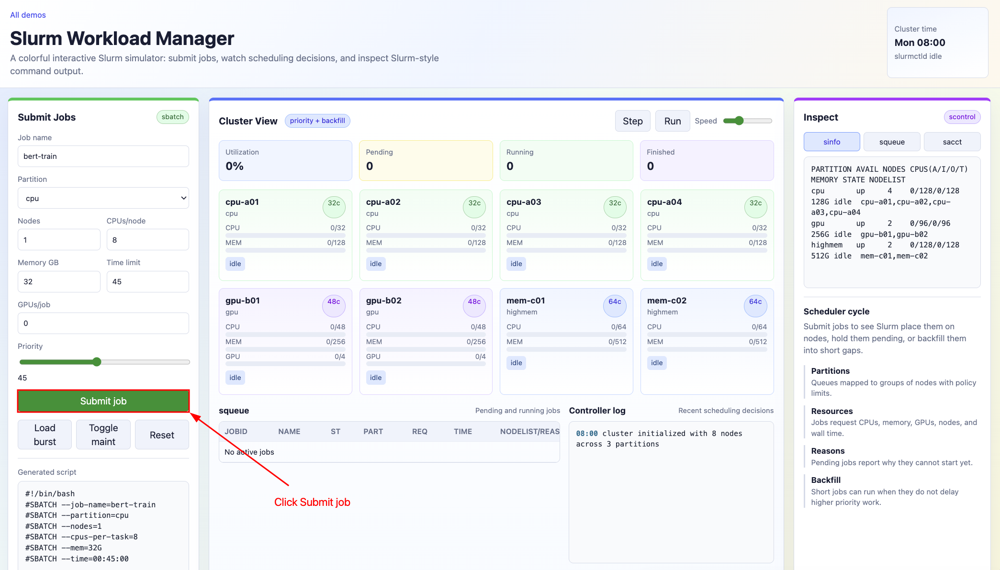

### Step 3: Submit the job

**Action:** Click **Submit job**.

**You should see:**
- ▶️ **Running** counter changes to `1`
- 📋 `bert-train` appears in `squeue` with state `R` (running)
- 🖥️ A CPU node card shows a job chip like `1001 bert-train`
- 📝 Controller log shows "accepted" and "started"

**Why it matters:**  
Slurm found a free CPU node with enough CPU and memory. The job got an **allocation**—reserved resources stay locked until the job finishes.

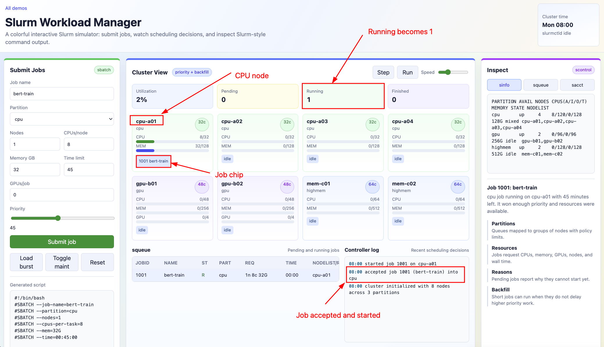

### Step 4: Verify in squeue

**Action:** Click **Inspect → squeue**.

**You should see:**
- State: `R` (running)
- `NODELIST(REASON)`: Shows node name, like `cpu-a01`

**Why it matters:**  
`squeue` is the "what's happening now?" command. Running jobs show the node. Pending jobs show the reason they wait.

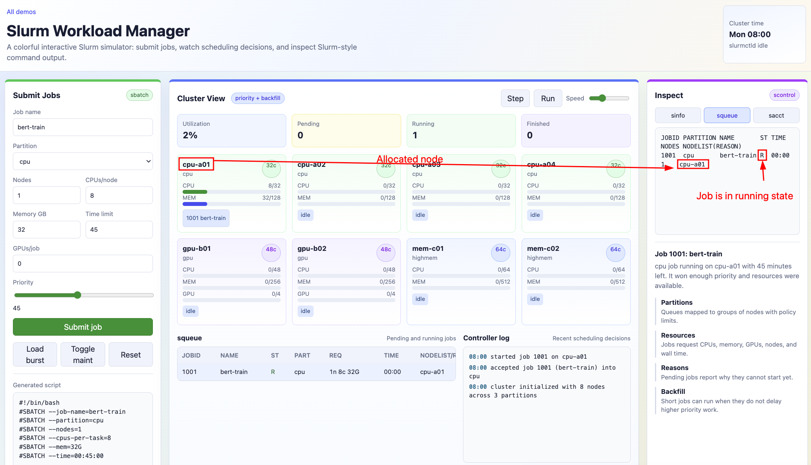

### ✓ Check your understanding

**Before moving on, answer these:**
- Which partition did your job use?
- Which node did Slurm assign?
- Where do you go to see live jobs?
- Why did it start immediately (not wait)?

---

## Journey 2: Partitions and Node Types

> **Goal:** Learn why partition choice determines which nodes can run your job.  
> **Main concept:** A partition is a pool of nodes. Jobs can only run on nodes in the selected partition.

### Step 1: View all partitions

**Action:**
1. Click **Reset**.
2. Go to **Inspect → sinfo**.

**You should see:**

| Partition | Nodes | Purpose |
|---|---|---|
| `cpu` | 4 | General CPU workloads |
| `gpu` | 2 | GPU training/inference |
| `highmem` | 2 | Large memory jobs |

**Why it matters:**  
`sinfo` is Slurm's "what exists?" command. Before submitting, check what partitions and nodes are available. The partition you choose filters which nodes are eligible.

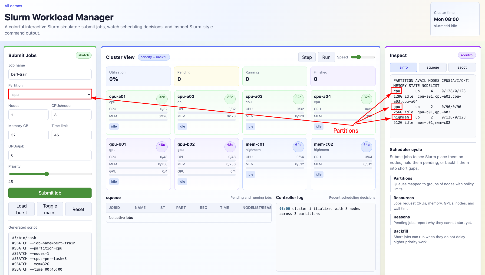

### Step 2: Submit to CPU partition

**Action:** Keep partition = `cpu`. Click **Submit job**.

**You should see:**
- 🖥️ Job lands on a CPU node
- ⏸️ GPU and highmem nodes stay idle
- 📝 squeue shows the job running on `cpu-*` node

**Why it matters:**  
The partition is the first filter. Even with idle GPU nodes, a `cpu` partition job won't use them. The wrong partition = no access, regardless of free resources.

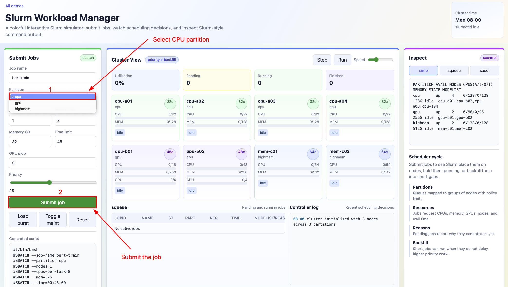

### Step 3: Compare node hardware

**Action:** Look at the node cards. Compare `cpu-a01`, `gpu-b01`, and `mem-c01`.

**You should notice:**
- 🖥️ CPU nodes: No GPU bar
- 📊 GPU nodes: GPU utilization bar visible
- 💾 Highmem nodes: Much larger memory capacity

**Why it matters:**  
Partitions usually map to different hardware. Choosing a partition is like choosing the *type* of resources available. Real clusters use partitions for policy too: debug (short jobs), long (high time limit), premium (charged differently), etc.

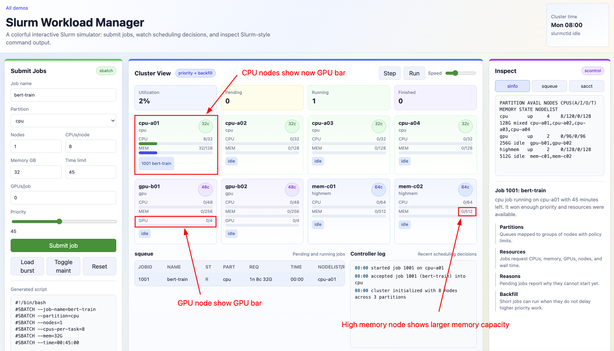

### ✓ Check your understanding

**Question:** If a GPU node is idle, can a `cpu` partition job use it?  
**Answer:** No. Partition filtering happens first.

---

## Journey 3: Pending Jobs and Reasons

> **Goal:** Learn to read pending jobs and know whether to wait or change the request.  
> **Main concept:** Pending has a *reason*. The reason tells you if waiting helps or if you need a different request.

### Step 1: Request GPU on CPU partition (impossible)

**Action:**
1. Click **Reset**.
2. Set **Job name** to `gpu-on-cpu`.
3. Set **Partition** to `cpu`.
4. Set **GPUs/job** to `1`.
5. Click **Submit job**.

**You should see:**
- ⏸️ **Pending** counter = 1
- 📋 `squeue` shows state `PD` (pending)
- 🔴 `NODELIST(REASON)` = `GRES`

**Why it matters:**  
`GRES` = "Generic Resource" = GPU (or other device). CPU nodes have zero GPUs. This isn't "wait for a free GPU"—it's "impossible with the selected partition."

**Key lesson:** Pending ≠ "cluster is full." It means "your request doesn't match any eligible node."

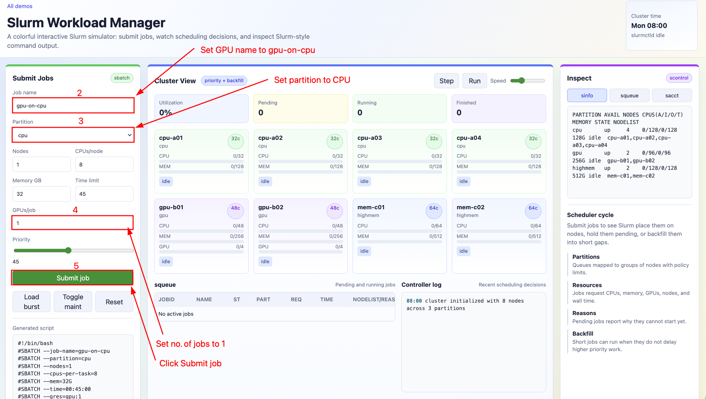

### Step 2: Understand the pending reason

**Action:**
1. Go to **Inspect → squeue**.
2. Click the `gpu-on-cpu` job row.
3. Read the detail explanation.

**You should understand:**
- CPU partition + GPU request = impossible match
- GRES pending means "wrong partition" or "resource doesn't exist here"

**Why it matters:**  
When your job pends, always read the reason. Don't guess:
- `Resources` → Wait or reduce size
- `GRES` / `Memory` / `CPUs` → Change partition or reduce request
- `Maintenance` → Wait for admin to clear it

---

### Step 3: Fix the request

**Action:**
1. Set **Job name** to `gpu-fixed`.
2. Set **Partition** to `gpu`.
3. Keep **GPUs/job** = `1`.
4. Click **Submit job**.

**You should see:**
- ✅ `gpu-fixed` runs on a GPU node
- 🎨 GPU bar shows allocation
- ⏸️ `gpu-on-cpu` still pending (never changes unless you submit a corrected version)

**Why it matters:**  
Same request, different partition = different result. Slurm can't retroactively fix an old job. You submit a new one. (In real Slurm, you'd `scancel` the bad job first.)

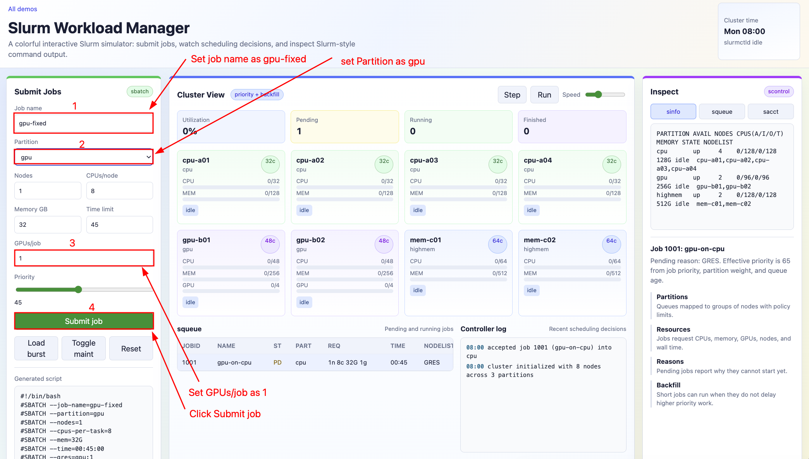

---

### ✓ Check your understanding

**Question:** Why did `gpu-on-cpu` pend when the cluster was idle?  
**Answer:** Because CPU nodes have zero GPUs. It's not a capacity problem—it's an eligibility problem.

---

## Journey 4: Busy Cluster, Priority, and Backfill

**Goal:** Watch several jobs compete for heterogeneous resources.

**Main concept:** Priority decides ordering, but a job still needs a feasible slot.

### Step 1: Load a mixed workload

**Action**

1. Click **Reset**.
2. Click **Load burst**.

**Expected result**

- Jobs start across CPU, GPU, and high-memory nodes.
- Utilization increases.
- The controller log lists several accepted and started jobs.

**Why it matters**

Real clusters rarely schedule one job at a time. They continuously evaluate a queue of different job shapes: small CPU jobs, multi-node CPU jobs, GPU jobs, memory-heavy jobs, and short jobs.

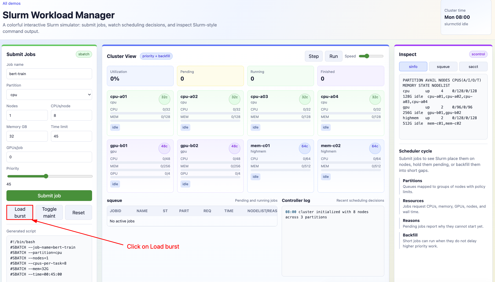

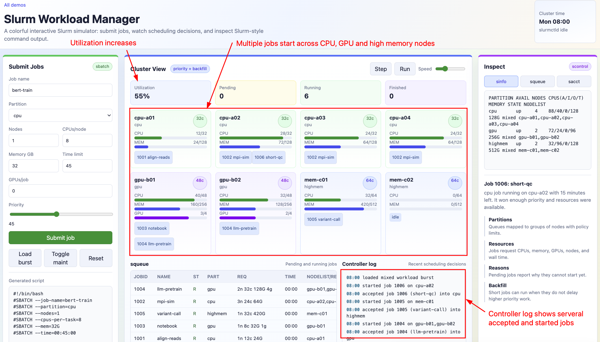

### Step 2: Read the queue order

**Action**

1. Click **squeue**.
2. Compare job states and requested resources.

**Expected result**

- `R` jobs are running.
- `PD` jobs are waiting.
- Some jobs request multiple nodes.
- Larger requests may wait even when smaller jobs can run.

**Why it matters**

Scheduling is not only about total free CPU. A multi-node job needs enough compatible nodes at the same time. A GPU job needs GPU, CPU, and memory together. A high-memory job needs a partition that can provide enough memory.

### Step 3: Watch resource packing

**Action**

1. Look at the CPU, MEM, and GPU bars on node cards.

**Expected result**

- Multiple jobs may share one node when their combined request fits.
- GPU jobs consume GPU plus companion CPU and memory.
- Memory-heavy jobs land on high-memory nodes when submitted there.

**Why it matters**

Schedulers pack jobs onto nodes to improve utilization. A node can be partially full: for example, CPU may be heavily used while memory remains available, or GPUs may be consumed while CPU is still available.

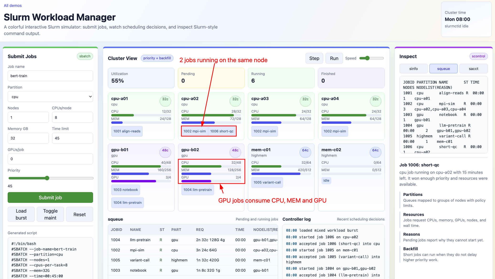

### Step 4: Identify backfill behavior

**Action**

1. Look for short jobs such as `short-qc`.
2. Compare controller log messages with the queue.

**Expected result**

A short job may start in a gap while a larger or higher-priority job waits.

**Why it matters**

Backfill improves utilization. The scheduler may allow a short job to run if it fits into a gap without delaying a higher-priority reservation. This is common on production Slurm clusters.

### Check your understanding

A high-priority job is not guaranteed to start immediately. It still needs a resource shape that fits the current cluster state.

---

## Journey 5: Wall Time and Accounting

**Goal:** Watch jobs finish, leave `squeue`, and appear in `sacct`.

**Main concept:** `squeue` is live state. `sacct` is history.

### Step 1: Start jobs

**Action**

1. Click **Reset**.
2. Click **Load burst**.

**Expected result**

Several jobs are running.

**Why it matters**

Each job has a time limit. In this simulator, every **Step** advances cluster time by five minutes. That makes job completion visible without waiting in real time.

This step matches the mixed workload screenshots in Journey 4.

### Step 2: Advance time

**Action**

1. Click **Step** repeatedly until **Finished** is greater than `0`.

**Expected result**

- Finished increases.
- Completed jobs disappear from `squeue`.
- Nodes release CPU, memory, and GPU allocations.
- Pending jobs may start when resources free up.

**Why it matters**

When a job ends, its allocation is released. That can change the answer for pending jobs. A job that was waiting for `Resources` may start after another job completes.

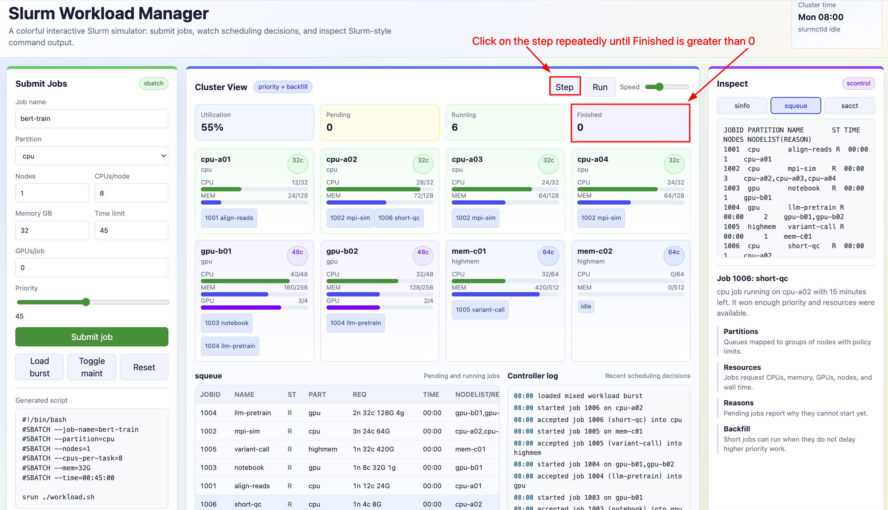

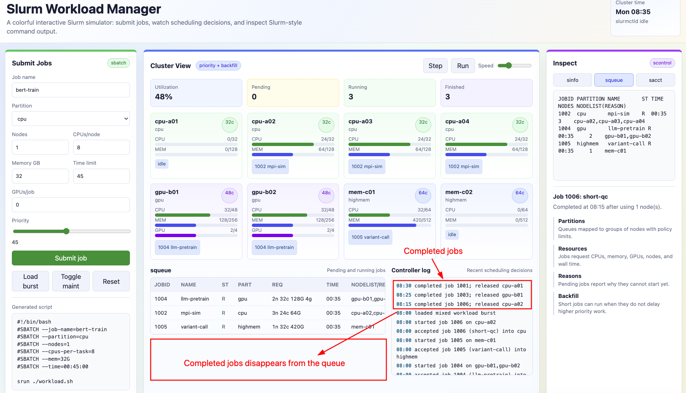

### Step 3: Inspect accounting

**Action**

1. Click **sacct**.

**Expected result**

Completed jobs appear with fields such as:

- Job ID
- Job name
- Partition
- Final state
- Elapsed time
- Allocated node count

**Why it matters**

Use `squeue` for active jobs. Use `sacct` for completed jobs. In real clusters, accounting records are important for debugging, reporting, usage tracking, and chargeback.

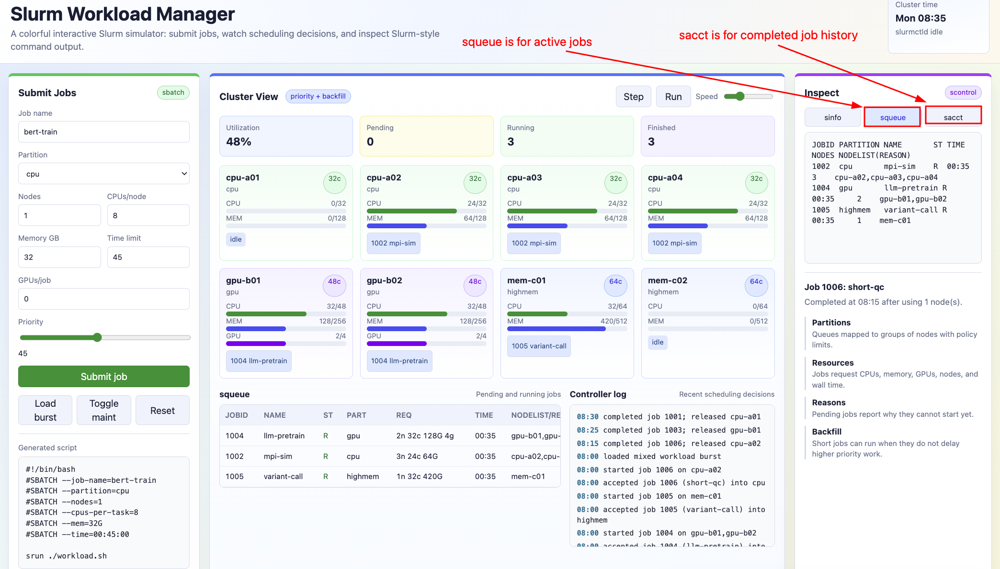

### Check your understanding

If a job completed successfully, should you expect to see it in `squeue`? No. Check `sacct`.

---

## Journey 6: Maintenance and Drained Nodes

**Goal:** See how node state affects scheduling.

**Main concept:** A valid request can still wait if the matching nodes are unavailable.

### Step 1: Drain some nodes

**Action**

1. Click **Reset**.
2. Click **Toggle maint**.

**Expected result**

- Some CPU nodes show `DRAIN`.
- The controller log records maintenance.

**Why it matters**

Admins drain nodes when they need to remove them from scheduling. A drained node may still exist and may even have the right hardware, but Slurm will avoid starting new work there.

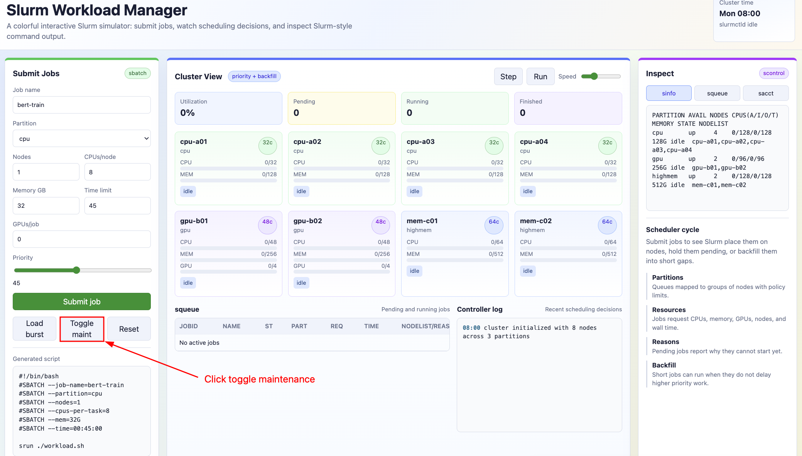

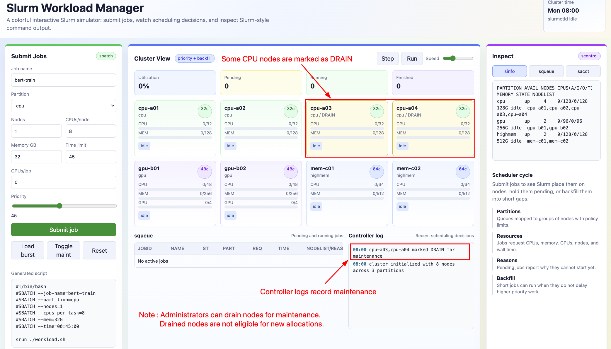

### Step 2: Submit CPU work

**Action**

1. Submit one or more CPU jobs. The default `bert-train` values are fine.
2. Watch which CPU nodes are chosen.

**Expected result**

- Scheduler avoids drained nodes when healthy capacity exists.
- If healthy nodes fill up, new work may pend with a `Resources`-style reason.

**Why it matters**

A node must pass all filters:

```text
right partition + schedulable node state + enough free resources
```

Drained nodes fail the node-state check.

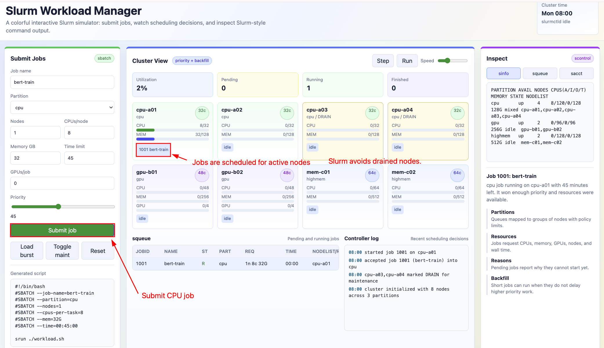

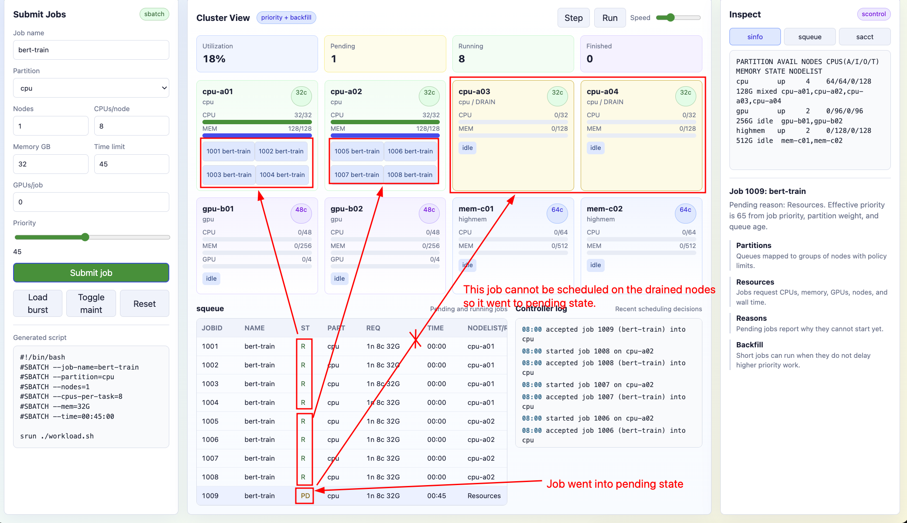

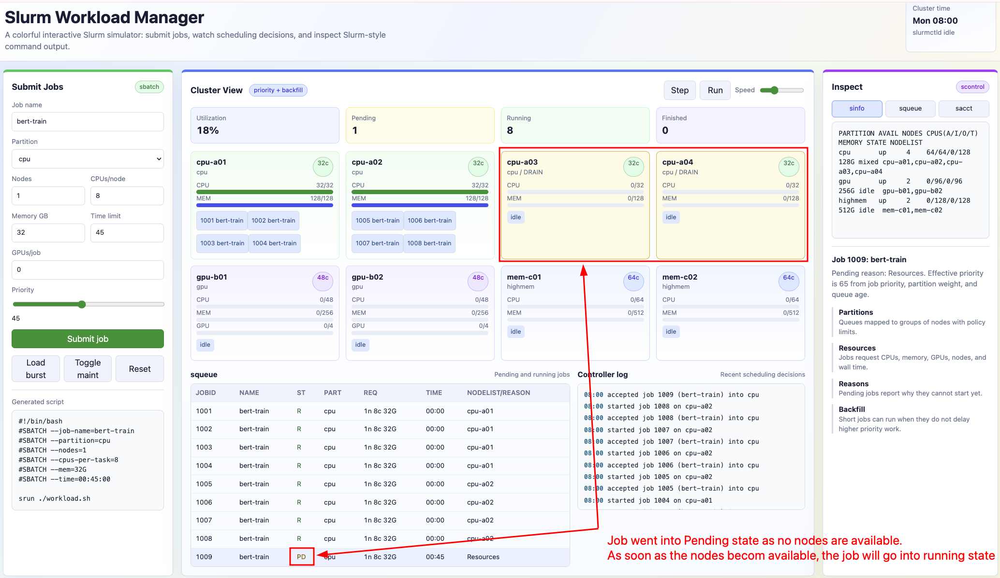

### Step 3: Clear maintenance

**Action**

1. Click **Toggle maint** again.
2. Click **Step** if jobs are still pending.

**Expected result**

- Drained nodes return to the eligible set.
- Previously blocked jobs may start when capacity is available.

**Why it matters**

Scheduling is dynamic. Queue state can change because users submit jobs, jobs finish, priorities age, or admins change node state.

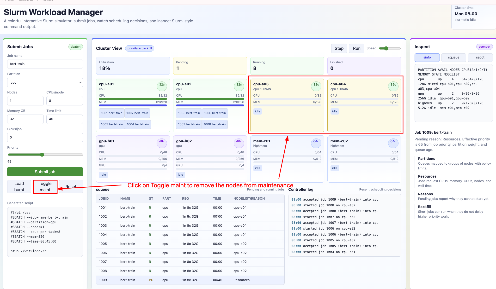

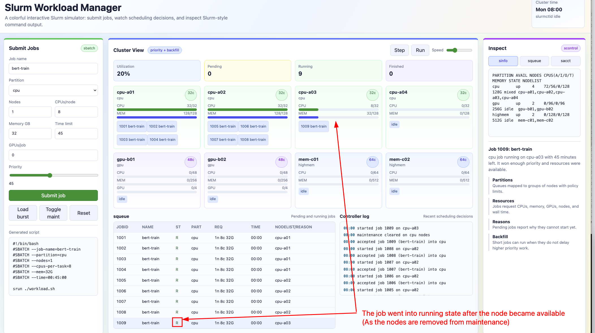

### Check your understanding

Can a job pend even when a drained node has enough CPU and memory? Yes. Drained nodes are not eligible for new allocations.

---

## Journey 7: Free Exploration Challenges

**Goal:** Predict scheduler behavior before clicking.

For each challenge:

1. Click **Reset** unless the challenge says otherwise.
2. Enter the request.
3. Predict whether it will run or pend.
4. Submit.
5. Use `squeue`, node cards, and the controller log to explain the result.

### Challenge 1: Small CPU-only job

**Try**

| Field | Value |
|---|---|
| Partition | `cpu` |
| Nodes | `1` |
| CPUs/node | `4` |
| Memory GB | `8` |
| GPUs/job | `0` |

Click **Submit job**.

**Predict**

- Will it run or pend?
- Which node type should it use?

**Expected**

It should run on a CPU node if a slot exists. The request is small and matches CPU hardware.

The screenshot uses slightly different numbers but illustrates the same idea: a small CPU-only footprint packs onto a CPU node.

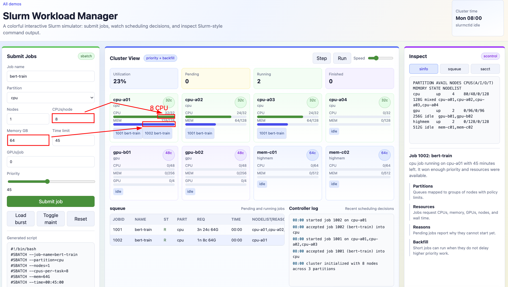

### Challenge 2: Too much memory for CPU

**Try**

| Field | Value |
|---|---|
| Partition | `cpu` |
| Memory GB | `512` |

Click **Submit job**.

**Predict**

- Can any `cpu` node satisfy 512 GB?
- What reason should appear?

**Expected**

It should pend with a memory-related reason. CPU nodes in this demo have 128 GB each. The `highmem` partition has the 512 GB nodes.

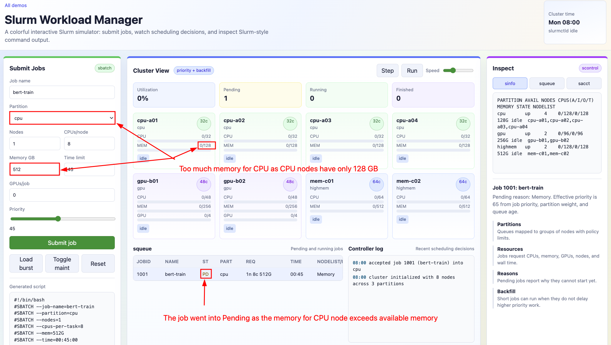

**Follow-up**

Submit the same memory request to `highmem`. It should run if a high-memory node is free.

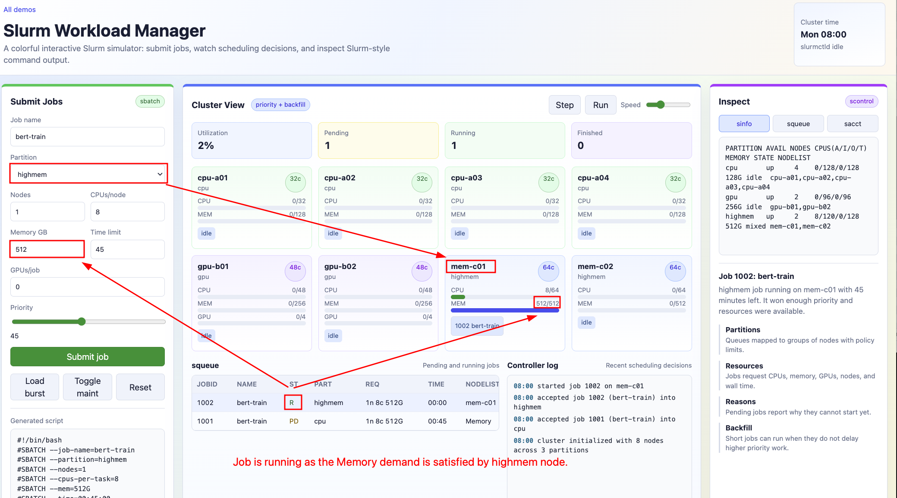

### Challenge 3: GPU request on GPU partition

**Try**

| Field | Value |
|---|---|
| Partition | `gpu` |
| GPUs/job | `2` |
| CPUs/node | `16` |
| Memory GB | `64` |

Click **Submit job**.

**Predict**

- Which node type should Slurm pick?
- Which resource bars should change?

**Expected**

It should run on a GPU node if two GPUs and the companion CPU and memory are free. The GPU, CPU, and MEM bars should all reflect allocation.

There is no companion screenshot for this challenge yet. Use `squeue` and the node GPU bars to verify.

### Challenge 4: Multi-node CPU job

**Try**

| Field | Value |
|---|---|
| Partition | `cpu` |
| Nodes | `3` |
| CPUs/node | `24` |
| Memory GB | `64` |

Click **Submit job**.

**Predict**

- Are three eligible CPU nodes free at the same time?
- If not, what reason should appear?

**Expected**

It runs only if the scheduler can allocate three CPU nodes simultaneously. Otherwise it remains pending until enough compatible nodes are free.

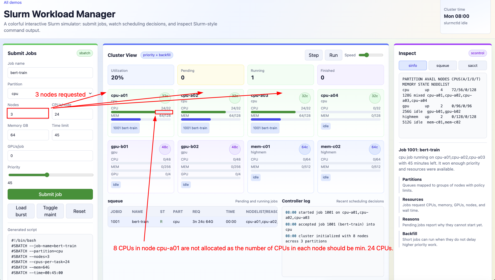

---

## Troubleshooting Guide

### 🔴 Job is pending (waiting)

**Do this:**
1. Go to **Inspect → squeue**.
2. Find your job.
3. Read the `NODELIST(REASON)` column. That's your answer.

| Reason | What happened | How to fix |
|---|---|---|
| `GRES` | You asked for a GPU on a partition without GPUs | Change partition to `gpu` or remove GPU request |
| `Memory` | Your memory request exceeds any node's capacity | Reduce memory or switch to `highmem` |
| `CPUs` | Your CPU request exceeds any node's capacity | Reduce CPUs per node |
| `Resources` | Request is valid, but no free slot right now | Wait or reduce the request size |
| `Maintenance` | Eligible nodes are drained for admin work | Wait for maintenance to clear |
| `Priority` | Another job has higher priority | Wait (user/admin can adjust priority) |

---

### 🟡 Job ran on a node I didn't expect

This is **normal** and **good**. In Slurm, you request resources, not specific nodes. The scheduler picks based on:
- Eligibility (partition match)
- Availability (free resources)
- Policy (load balancing, backfill, etc.)

This freedom lets Slurm optimize cluster use.

---

### 🟡 My completed job disappeared from squeue

**Expected behavior.** Completed jobs leave `squeue` immediately.

**To see them:** Go to **Inspect → sacct** to view job history.

---

### 🔴 Idle cluster, but my job still waits

**Checklist:**
- ✅ Are the idle nodes in *my* partition?
- ✅ Do they have the hardware I requested (GPUs? large memory)?
- ✅ Are they drained?
- ✅ Do I need multiple nodes *at the same time*?

If all are yes, the job *should* fit. If it doesn't, verify the request in **squeue** and check partitions in **sinfo**.

---

## Final Concept Map

A reference for key terms encountered in this demo:

| Term | Meaning | Where you see it |
|---|---|---|
| **`sbatch`** | Submit a batch job command | Submit Jobs form + Generated script |
| **Directive** | `#SBATCH` lines that Slurm reads | Generated script |
| **Partition** | Named pool of eligible nodes | Partition dropdown, `sinfo` |
| **Allocation** | Reserved resources for a running job | Job chips on nodes, resource bars |
| **Node state** | Whether a node accepts work (UP, DRAIN, etc.) | Node cards, `sinfo` |
| **`R`** | Running state | `squeue` |
| **`PD`** | Pending (waiting) state | `squeue` |
| **Pending reason** | Why a job waits | `NODELIST(REASON)` column in `squeue` |
| **Backfill** | Short job fills a safe scheduling gap | Controller log |
| **Wall time** | Maximum allowed job runtime | Time limit field, Step behavior |
| **`sacct`** | Completed job history/accounting | Inspect → `sacct` |

---

## What To Practice Next

**Now you understand the basics. Here's how to deepen your skill:**

### Experiment: Change one variable at a time

1. ✅ Start with a working CPU job (from Journey 1).
2. 📈 Increase **memory** slowly until it pends. Read the reason.
3. 🔄 Submit the same job to `highmem`. Does it run now?
4. ➕ Add **GPU request** while staying in `cpu`. Prediction: it pends (`GRES`).
5. 🔄 Switch to `gpu` partition. Does the GPU request work now?
6. 🔢 Increase **node count** to 3. Watch multi-node placement.

### What you're learning

**Not:** "What's the right memory value?"  
**But:** "How do I read a request, check cluster state, and predict the scheduler's decision?"

This is the core skill: debugging and predicting *any* scheduling scenario.

---

**Ready for more?** Check out:
- Real Slurm docs: https://slurm.schedmd.com/
- HPC cluster job submission tutorials
- Your local cluster's documentation (often has partition-specific guidance)

**Done here?** Great—you've mastered the fundamentals. 🎉
